# Face_Recognition_TF
This project consist of implementation of FaceNet and focus is not on the training but on the application side and deployment side
It contain scripts for Face detection and Face recognition which can be directly used in other apps to addded face recognition to the project. 
# FaceNet
FaceNet is the current state of the art method to face Recognition/verification with accuracy of 99.63 on LFW dataset and 95.12 on Youtube Faces Dataset. It was first published in paper [FaceNet: A Unified Embedding for Face Recognition and Clustering](https://arxiv.org/abs/1503.03832) by amazing Florian Schroff, Dmitry kalenichenko, james Philbin from google research team. 

Rather than classifying images directly from a softmax classifier or with siamese network. FaceNet goes to a completely different route, A new loss called as triplet loss is introduced in this paper. This loss function is as follow 


where, 
* Fia is face embedding for a anchor image
* Fip is face embedding for a positive image
* Fin is face embedding for a negative image
* alpha is margin (alpha is an hyper parameter)

This loss work on euclidian distance between the three images, To train a network yourself you will need three images per example (i.e. one anchor image one positive and one negative) this loss function tries to reduce the euclidian distance between anchor and positive image and tries to increase the the euclidian distance between anchor image and negative image. 


learn more about triplet loss [here](https://www.youtube.com/watch?v=d2XB5-tuCWU&ab_channel=DeepLearningAI)

# Pretrained Model
I have taken the pretrained InceptionResNet model from [nyoki-mtl github repo](https://github.com/nyoki-mtl/keras-facenet)
This repo contained model weights in older version of keras, so when I tried to load model weigths in newer version of tensorflow I got 'bad marshal error' Then I realized that since keras was integrated in tensorflow as backend the saving formate is changed and those all keras model do not load in newer version. I tried bunch of thing to load them in latest version, Finally I found the soultion I did following things
1. I created a virtual environment as recommended by in the repo and loaded model weights in the older version of keras
2. I extracted weights af all layers layer-by-layer into a .npz numpy save format
3. I used source code of model in the repo to construct model in newer version of tensorflow-keras
4. Then loaded the previously extracted weights to this new model layer-by-layer from .npz files
5. That's how I recovered the weights

You can export the model in single keras .h5 format. I did excatly that to use the model as pre trained model for transfer learning in another project. It had differnt version of Tensorflow it still gave 'Bad marshal' error. So I recommend using the layer by layer weights they are independent of the tensorflow version :smile:. To load the weights look 'load_model' method in Inference/FaceRecognizer.py file

# Project directory structure Structure
folders discription
* DataBase - here, Database is stored by default (currently project does not support multiple datbae but coming soon in flask app)
* images - put your images here code will run face detection on images in this folder when app.py is run
* Infered_image - Resulting images will be saved her by default when app.py is run
* Model - model weights and other model related big files are stored here
* People - contain images of faces of people you want to detect. Remember, faces need to be cropped over face see examples in the folder  (Add your face here! :smile: )
rest folder i.e. Inference and Training contains code, ignore them

# How to use this repository 
Follow the steps as follow 
1. install required packages just run following command in powershell/terminal
     ```pip install -r requirements.txt ```
2. run **download_model_weights.py** script to download the model pretrained weights
3. Put the Face cropped images of people you want to detect into 'People' folder (you can delete the the existing images in the folder) only crop face for accurate results. Name the image with the name of that person.
4. run **Load_people_into_DataBase.py** This will add faces in the folder into DataBase. Remember this one will not replace the existing database only add new entries. If you want to reset the Database just delete 'Database.json' file into DataBase folder.
5. Put images you want to detect faces in, into 'images' folder. No limit on images! But know that it might take long for many images
6. run app.py It will also show each image one by one as it is done.
7. Find your resulting images in 'Infered_image' folder
8. That's it !!! :smile:

# How to use the code into your project
Your project should have a DataBase and Model folder in root directory. just copy folder Inference and utils.py in you ptojects root folder. then import **detector** class from utils that's it. Open app.py file to see how to use detector class. Documentation about arguments and output is given in utils.py as comments.

# Results:
F.R.I.E.N.D.S is one of the best sitCom ever, So let's see out Recognizer can recognize the cast correctly. 
* I saved faces of all main 6 charecter into the People folder (refer this naming and croppin schem for your project
* Then ran load_people_into_DataBase.py
* then put some random images from internet into images folder and ran app.py and I got following results

Original image             |  Resulting image
:-------------------------:|:-------------------------:
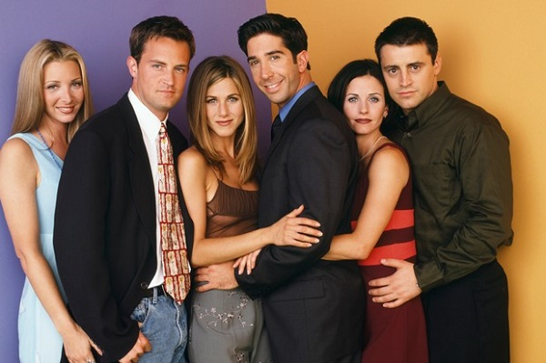  |  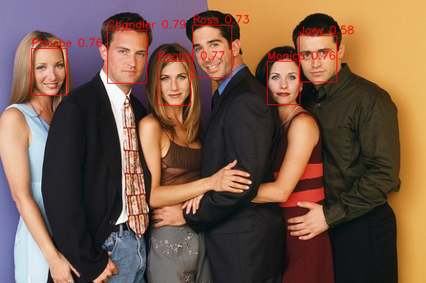
  |  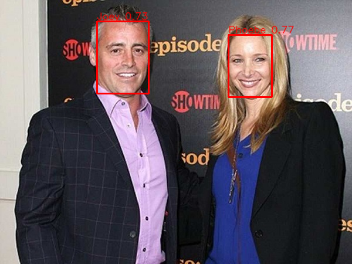
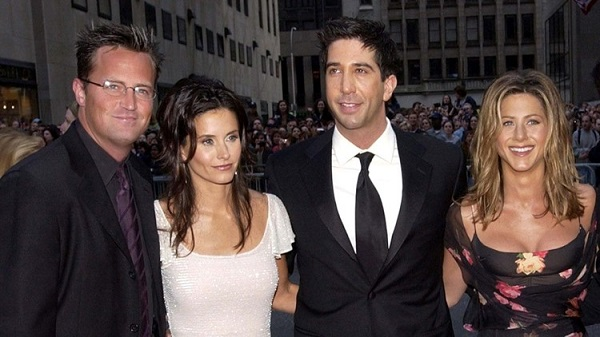  |  
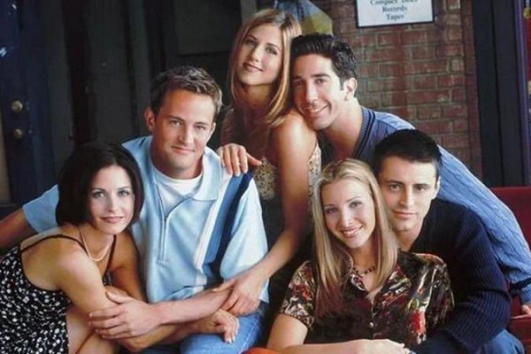  |  
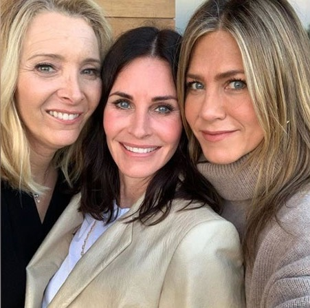  |  
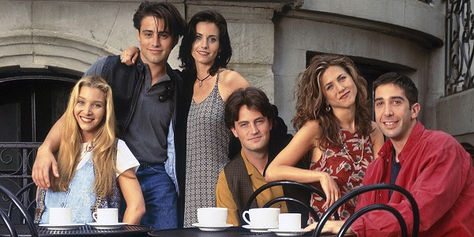  |  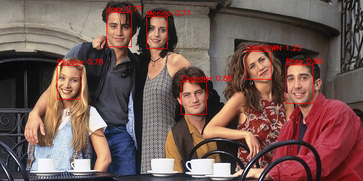
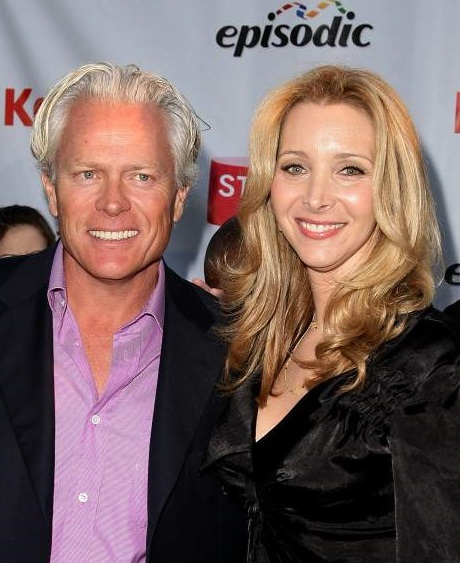  |  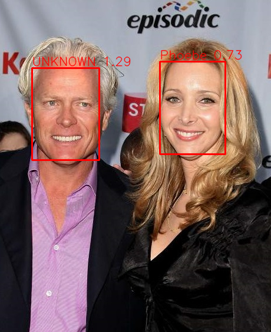
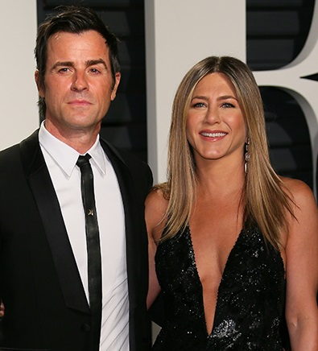  |  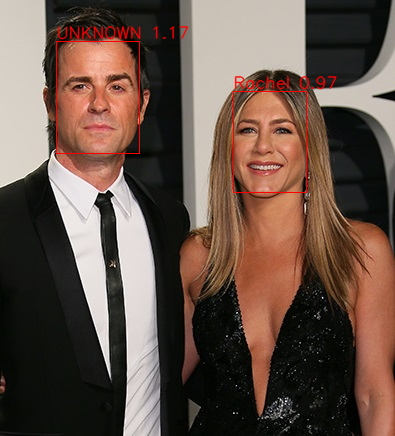

**images are taken only for educational purpose**
In some cases the model guessed Rachel wrong in image 5 and image 6
In image 5 the image is of older Jennfier aniston that is why our code misclassified it although threshold is set to 1 in the code that is anyone greater than ruclidian distance greater than 1.0 is tagged as UNKNOWN you can also see that the distance is 1.03 very close
In image 6 the the Face is tilted to side a little hence the model got confused there

# References:-
1. pretrained model - https://github.com/nyoki-mtl/keras-facenet
2. FaceNet paper - https://arxiv.org/abs/1503.03832
3. MTCNN library - https://github.com/ipazc/mtcnn

# What's upcoming

Upcoming Features:-
1) an Flask based app to use the code as a web app (deployed version)
2) Docker image of flask app ready to deploy

Features the Flask app will have
1) selecting image fro mdirectory
2) Detecting faces in video or realtime feed from web cam or some online stream source

Sometime in future (When the resources will be available I do not have rpi or arduino :sob:):-
1) EfficientNet based small but accurate model
2) Tiny model which can be used in Microcontroller
3) Integration to use the app with Arduino and raspeberry pi


